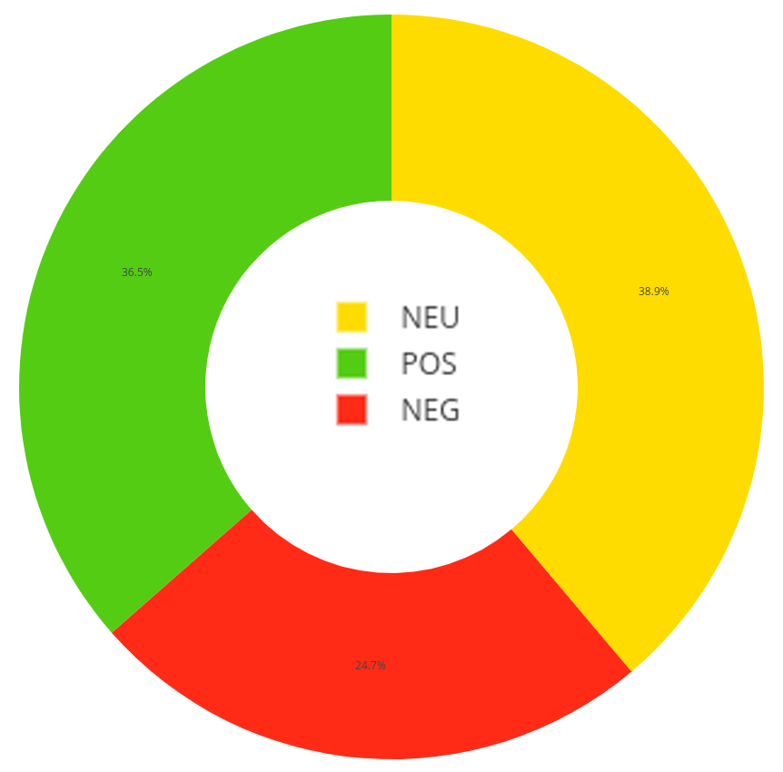
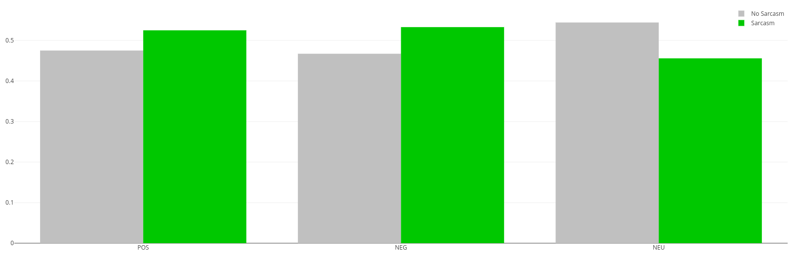
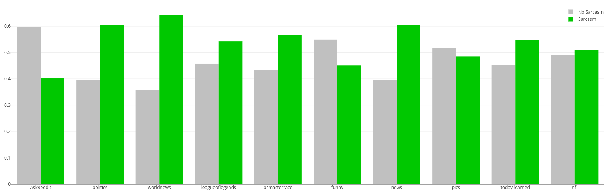
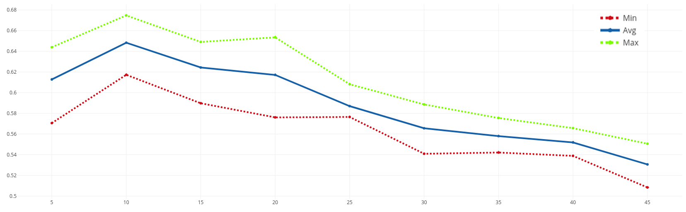
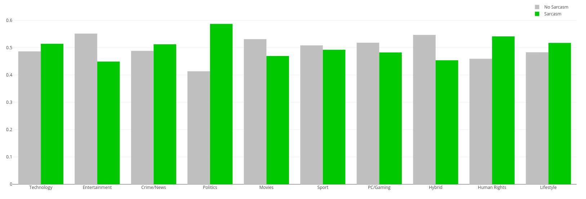

# SarcasmOnReddit
An sarcasm analytics on posts from Reddit

## Introduction
Sarcasm is a form of communication act in which the speakers implicitly communicate their message. The intrinsically ambiguous nature of sarcasm makes it laborious even for humans to determine whether a comment is sarcastic or not. Recognition of sarcasm can help many sentiment analysis NLP applications, such as review summarization, dialogue systems and review ranking systems. To have an insight on how sarcasm is expressed on social media, I examined a dataset of self-annotated data from the social news website and forum Reddit. Posts on Reddit are organized by subject into user-created boards called “subreddits”, which cover a variety of topics. The idea of Reddit involves evaluating posts and using upvotes or downvotes to measure their importance on the site. The main purpose of the analysis consists in answering to these questions:

* Are any linguistic feature that can help detecting sarcasm?
* Is there a relation between sentiment and sarcasm?
* Which are the topics that people tend to react more sarcastically?

## Analytics

### POS
Distribution of sarcasm for POS tags:

### Sentiment
Sentiment Distribution:

Distribution of Sarcasm across different sentiment:

### Topic Modeling

Various subreddits have different distribution of sarcasm:

However, the subreddits might have different subtopics. To find the topics we use LDA, and to find the number of topic, use use perplexity:

The distibution of sarcasm across topics:

Check the in deep [report.pdf](report.pdf) for the full view.
